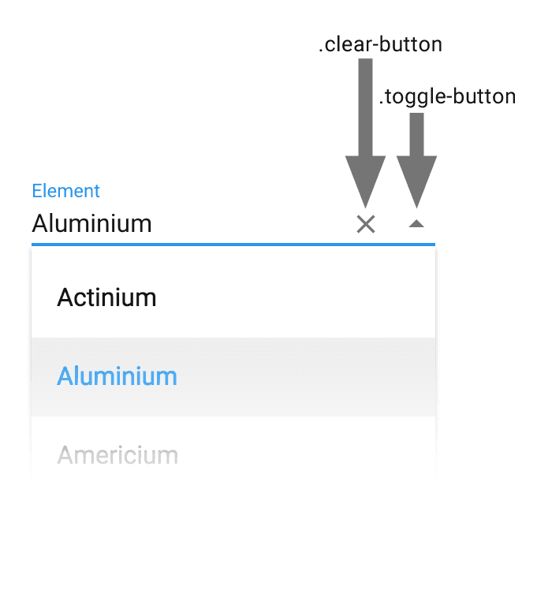

[[vaadin-combo-box.customization]]
= Customizing the Input Field

The [vaadinelement]#vaadin-combo-box# element allows you to customize parts of the user interface by replacing the content with any other elements.
You can replace individual icons by adding elements with `clear-button` and `toggle-button` class names.
If that's not enough, you can also replace the whole input field by using the [vaadinelement]#vaadin-combo-box-light# element.
This chapter will explain these customization options more detail.

== Using Custom Icons

By default the [vaadinelement]#vaadin-combo-box# has two icons, a toggle icon for opening the dropdown and a clear icon for clearing the selected value.
You can replace these with your own custom icons or buttons by using `toggle-button` and `clear-button` class names.
Using any element is allowed, but a `paper-icon-button` will make your life a bit easier as it will get some default styles applied automatically.

[[figure.vaadin-combo-box.overview]]
.Overview of icon customization options for the [vaadinelement]#vaadin-combo-box# element

[source,html]
----
<vaadin-combo-box label="Custom Icons">
  <paper-icon-button icon="remove-circle" class="clear-button"></paper-icon-button>
  <paper-icon-button icon="search" class="toggle-button"></paper-icon-button>
</vaadin-combo-box>
----

Two special class names are also available for the custom buttons.
|===
|Class name |Purpose

|`small`
|Makes a `paper-icon-button` slightly smaller. Used by the default `clear-button`.

|`rotate-on-open`
|Rotates the element 180 degrees when the dropdown is opened. Used by the default `toggle-button`.
|===

If you would like to apply some custom styles specific to the state of the element, the [vaadinelement]#vaadin-combo-box# reflects following properties to an attribute.

|===
|Attribute |Is Present When

|`opened`
|The dropdown is open.

|`has-value`
|A value is selected.

|`readonly`
|The element is in read-only mode.

|`disabled`
|The element is disabled.
|===

== Replacing the Input

If changing the icons is not enough, you can also replace the whole input element.
In order to do this, you need to use [vaadinelement]#vaadin-combo-box-light#.
This element is a light version of the full [vaadinelement]#vaadin-combo-box# and it provides only the dropdown functionality.

The custom input element must have a property for the value, which is available for two-way data-binding.
By default it is expected that this property is named [propertyname]#bindValue# to make it compatible with link:https://elements.polymer-project.org/elements/iron-input[[elementname]#iron-input#].
You can change the property name with the [propertyname]#attrForValue# property.

In order to create a simple `iron-input`-based combo box, you can just wrap the input inside a [vaadinelement]#vaadin-combo-box-light# element.

[source,html]
----
<vaadin-combo-box-light>
  <iron-input>
    <input>
  </iron-input>
</vaadin-combo-box-light>
----

If you wish to build something more similar to the default combo box, you can for example use link:https://elements.polymer-project.org/elements/paper-input[[elementname]#paper-input#].
See the example below, which also uses the [propertyname]#prefix# and [propertyname]#suffix# attributes to position the icon and buttons.

[source,html]
----
<vaadin-combo-box-light attr-for-value="value">
  <paper-input label="Elements">
    <iron-icon icon="toll" prefix></iron-icon>
    <paper-button suffix class="clear-button">Clear</paper-button>
    <paper-button suffix class="toggle-button">Toggle</paper-button>
  </paper-input>
</vaadin-combo-box-light>
----
