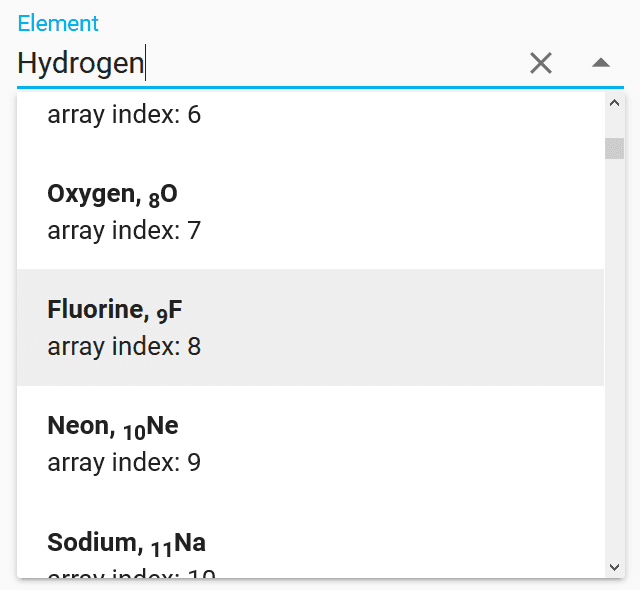
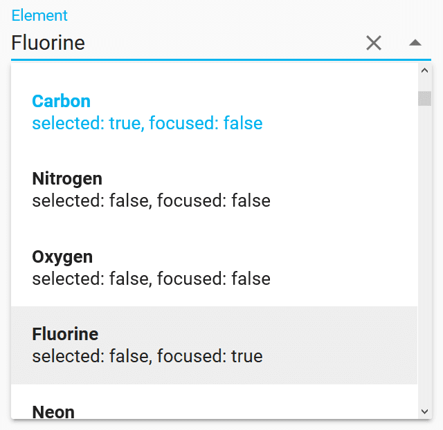
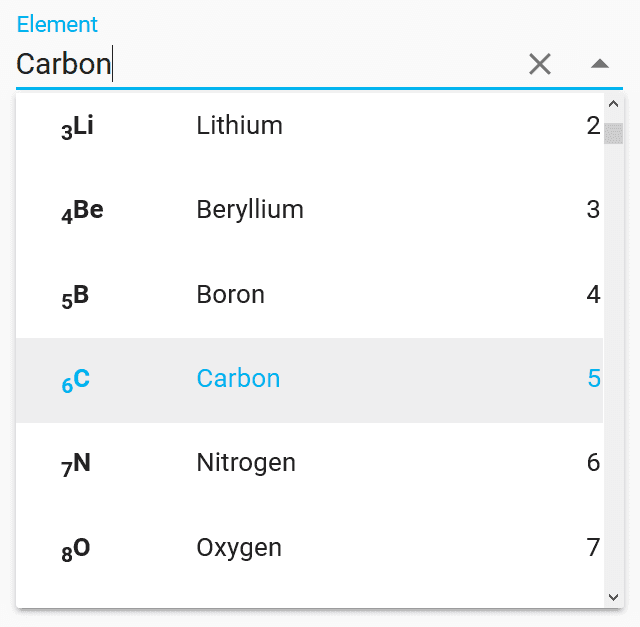
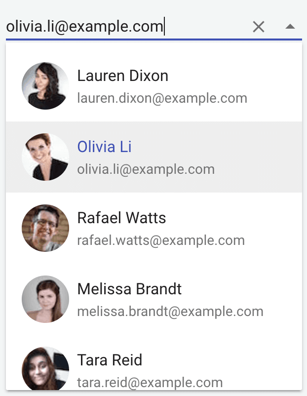

[[vaadin-combo-box.item-template]]
= Using Custom Item Template

By default, items are displayed in the overlay as a list of plain strings. For some use cases it is not enough, especially when it is required to display a few Object keys in each item.

In order to give a custom markup for items, you can provide a custom item template in the light DOM of [vaadinelement]#vaadin-combo-box#.

[NOTE]
When using object items, and item templates, it is still necesary to set the `item-label-path` property, because the value specified by this is displayed in the input field when the item is selected, and it's also used for filtering.

[source,html]
----
<vaadin-combo-box
    id="elements-template-box"
    label="Element"
    item-label-path="name"
    item-value-path="symbol">
  <template>
    <b>[[item.name]], [[item.number]][[item.symbol]]</b> 
    array index: [[index]]
  </template>
</vaadin-combo-box>

----

[[figure.vaadin-combo-box.item-template1]]
.Using Custom Item Template

In the above example, the [vaadinelement]#vaadin-combo-box# element has the custom item template, that renders [propertyname]#number#, [propertyname]#symbol#, and [propertyname]#name# keys from the given object items.

=== Item Template Variables

The following properties are available for item template bindings:

|===
|Property name |Type |Description

|[propertyname]#index#
|[classname]#Number#
|Index of the item in the [propertyname]#items# array

|[propertyname]#item#
|[classname]#String# or [classname]#Object#
|The item reference

|[propertyname]#selected#
|[classname]#Boolean#
|True when item is selected

|[propertyname]#focused#
|[classname]#Boolean#
|True when item is focused
|===

[[vaadin-combo-box.item-template.states]]
== Selected and Focused Flags

You can use [propertyname]#selected# and [propertyname]#focused# flags in the item template to read the item state.

[source,html]
----
<vaadin-combo-box id="elements-selected-box" label="Element" value="Carbon">
  <template>
    <b>[[item]]</b> 
    selected: [[selected]], focused: [[focused]]
  </template>
</vaadin-combo-box>

----

[[figure.vaadin-combo-box.item-template2]]
.Selected and Focused Flags

The above example shows the item states by binding to [propertyname]#selected# and [propertyname]#focused# template properties in the item text.

[[vaadin-combo-box.item-template.custom-element]]
== Styling Items with Custom Item Element

If styling the custom item template contents is necessary, you apply styles by defining a custom item element for your template and item styles.

The following example demonstrates defining a custom element. The [elementname]#my-item# element receives the [propertyname]#item# Object property and displays the specified item keys in columns using flex layout.

[source,html]
.my-item.html
----
<dom-module id="my-item">
  <template>
    

    
      [[item.number]][[item.symbol]]
    
    [[item.name]]
    [[index]]
  </template>

  
</dom-module>
----

[[figure.vaadin-combo-box.item-template3]]
.Styling Items with Custom Item Element

Then you can use the previously defined [elementname]#my-item# element in the item template of [vaadinelement]#vaadin-combo-box#:

[source,html]
----
<link rel="import" href="my-item.html">

<vaadin-combo-box id="elements-my-item-box" label="Element" item-label-path="name" item-value-path="symbol">
  <template>
    <my-item index="[[index]]" item="[[item]]"></my-item>
  </template>
</vaadin-combo-box>

----

[[vaadin-combo-box.item-template.material]]
== Item Template with Material Design

The [vaadinelement]#vaadin-combo-box#'s appearance follows Material Design guidelines.
In case you want the overlay items to follow Material Design as well, you can utilize [elementname]#paper-item# elements like in the following snippet.

[NOTE]
If you use images in the template, make sure they have pre-defined bounds so the layout doesn't break or jump once the images are resized after loading.

[source,html]
----
<vaadin-combo-box id="elements-paper-item" item-value-path="email" item-label-path="email">
  <template>
    <paper-icon-item style="padding: 0">
      
      <paper-item-body two-line style="min-height: 0">
        
[[item.name.first]] [[item.name.last]]

        
[[item.email]]

      </paper-item-body>
    </paper-icon-item>
  </template>
</vaadin-combo-box>
----

[[figure.vaadin-combo-box.item-template4]]
.Item Template with Material Design

