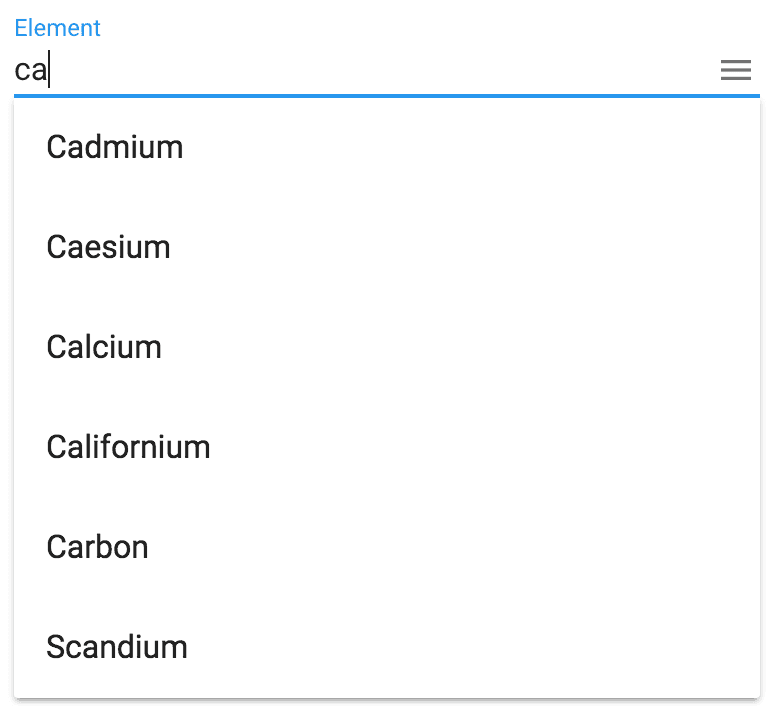

[[vaadin-combo-box.overview]]
= Overview

The [elementname]#vaadin-combo-box# is a Polymer element that combines a dropdown list of items with an input field for filtering them.

You can consider it as a filterable select element for situations where you have more than a few dozen items to select from.
It allows users to quickly filter the list and select an item using either keyboard, mouse, or touch actions.

= Features

- A filterable select element for situations where you have more than a few dozens of items to select from.
- Keyboard navigation
- Compatible with [elementname]#iron-form#
- Works great on mobile and desktop
- Material Design inspired styles to fit in with Paper Elements

= Limitations

- Selecting an item using the arrow keys on iOS does not work using an external keyboard (iOS limitation)

[[figure.vaadin-combo-box.overview]]
.A screenshot of the [vaadinelement]#vaadin-combo-box# element

