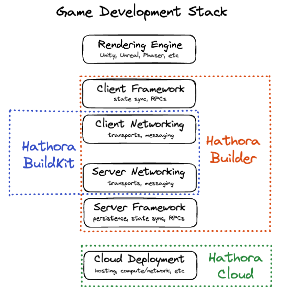

# Hathora

> A multiplayer game development framework & cloud hosting platform

Today, Hathora consists of three major components:

- [Hathora Builder](./builder/README.md): opinionated NodeJS server framework for multiplayer backends
- [Hathora BuildKit](./buildkit/README.md): SDKs to conform to the Hathora Protocol
- [Hathora Cloud](./cloud/README.md): managed hosting platform to run + scale Hathora Protocol applications

This is how the three parts fit in:

