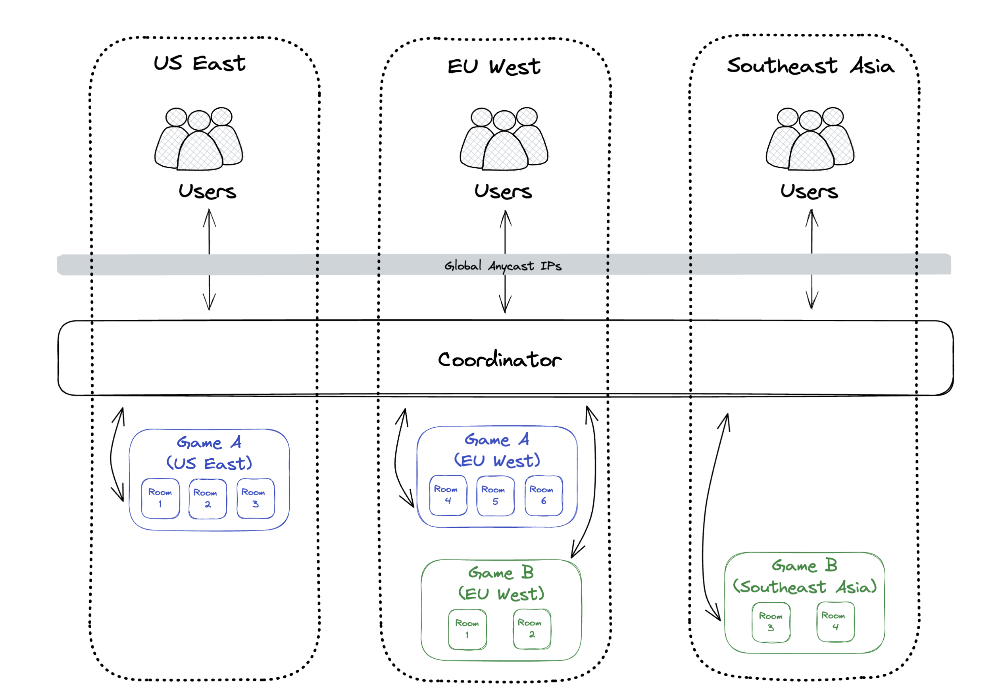

# Architecture

The Hathora architecture is designed to optimize for the following:

1. Minimze latency on extremely performant networks so games feel as immersive as possible.
2. Enable horizontal scaling and multi-tenancy (multiple rooms per process) so that Hathora apps support large numbers of users.
3. Reduce operational complexity so that its easy to run Hathora apps in production.

## Overview

In Hathora applications, clients don't directly communicate with backends. Instead, they go through a stateful load balancer / reverse proxy known as the Coordinator:



As we can see from the diagram, the Coordinator routes clients to the corresponding backend instance. Each backend instance can run multiple game sessions (states) but a given session runs on exactly one instance at a given time. Games can be migrated from one instance to another given instances write their data to a shared filesystem.

Additionally, the Coordinator is multitenent, meaning it is able to support connections for different applications. This is made possible because each Hathora application is assigned a unique appId, and both backends and clients include this appId when communicating to the Coordinator.

> For in-depth coverage on the Coordinator architecture, check out [this blog post](https://blog.hathora.dev/scalable-websocket-architecture/).

## Coordinator Features

### Load balancing

The Coordinator enables horizontal scalability by routing clients to multiple backend instances. Scaling a Hathora application is as simple as spinning up multiple instances of your backend. They will all register themselves with the Coordinator and the Coordinator will balance the load between them.

Note that this is a form of stateful routing -- the Coordinator has to maintain state of which session lives on which backend instance and route clients consistently based on this state.

### Authentication

The Coordinator handles authentication for Hathora applications. It houses the API endpoints with which users log in and receive tokens, and it verifies these credentials when users connect to a particular game session. This way, the actual game backends don't need to handle user authentication at all.

### Edge computing

Today, the Coordinator runs in 8 regions and more are planned for the future. The Coordinator uses the most streamlined networks, with over 1000 points-of-presence to optimally carry user traffic from residential or mobile ISPs to the data center where your game server is running. Cross-region user traffic is picked up at the closest PoP to the user and transited over the fastest links, instead of letting ISPs route over the cheapest links.

> For in-depth coverage on the network tests we performed to pick our infra providers, please check out [this blog post](https://blog.hathora.dev/cloud-latency-shootout/).

### Transport flexibility

The Coordinator provides WebSocket and TCP (with UDP coming soon) support for client connections. There's nothing your application needs to do to support the multiple protocols. The same server code can easily support Web, Mobile, Consoles and any other platform you are targeting.

### Transparent failover

Since clients don't connect directly to backends, the Coordinator is able to seamlessly migrate users to a new backend when the backend their game was originally was on goes down, all without the user noticing (other than perhaps a momentary bump in latency).

### Connection termination

The Coordinator handles SSL termination so that backends don't need to worry about it.

The Coordinator also implements support for multiple protocols (although only Websocket is implemented today) so that clients can connect with Websocket, TCP, UDP, etc and the backend doesn't need to be aware of the transport mechanism.

### Network topology

In a normal client/server set up, the client needs to connect directly to the server's IP address. This means that the server needs to advertise their IP to allow inbound connections, which can be a security risk (and some firewalls may prevent it).

With Hathora, servers only need one output TCP connection to the Coordinator -- all communication is done through this connection. This allows the server's IP address to remain private and you don't need to allow any inbound connections.

### Stream multiplexing

The Coordinator has many client connections but sends data to each backend across a single connection. This minimizes server resources on the backends.

### Monitoring and analytics

The Coordinator knows data about backend instance health, active client connections, running game sessions, and more. In the future, we want to expose this data to developers to help them understand their game's usage and performance characteristics.

## Data Privacy and Offline Development

There is a production cloud Coordinator instance deployed at Coordinator.hathora.dev, maintained by the Hathora team.

The Coordinator does not store any game data -- that lives entirely within the backend instances which you own. The Coordinator simply proxies game packets back and forth from clients and backend instances. The Coordinator does store user profile information in order to allow Hathora applications to perform userId lookups.

To develop locally without using the cloud Coordinator (e.g. for working offline), you can make use of the [local coordinator](https://github.com/hathora/local-coordinator). Simply start the local Coordinator process in a separate terminal tab, then set the `COORDINATOR_HOST` environment variable when starting the Hathora dev server:

```sh
COORDINATOR_HOST=localhost hathora dev
```
