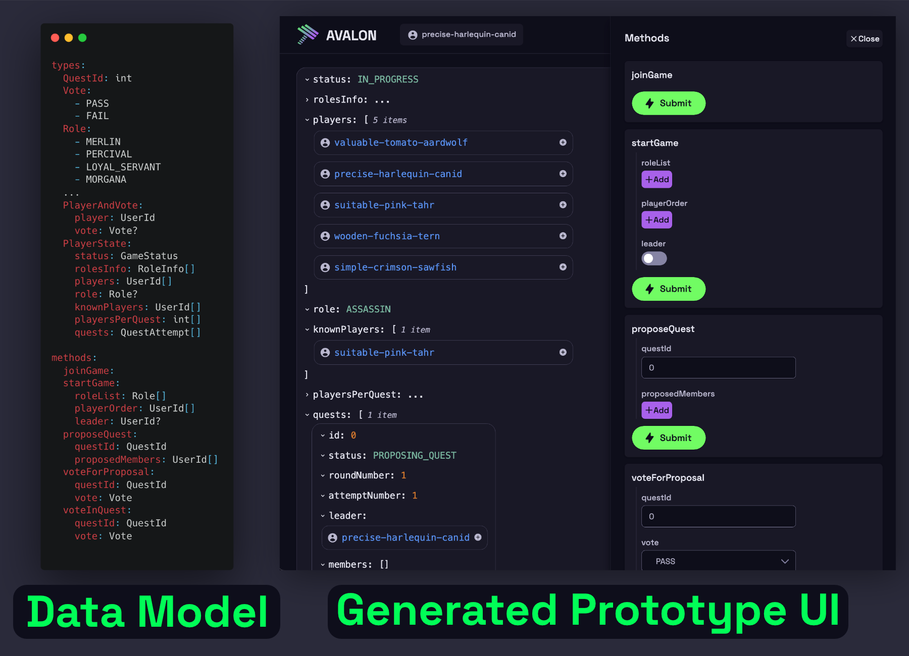

<div class="hathora-logo-with-super">
  
  <span class="hathora-logo-super">Builder</span>
</div>

<a href="https://github.com/hathora/builder" target="_blank" class="hathora-gh-link">
  
  <span>Hathora Builder</span>
  <span class="hathora-link-icon">
      <svg xmlns="http://www.w3.org/2000/svg" fill="none" viewBox="0 0 24 24" stroke-width="1.5" stroke="currentColor" class="w-6 h-6">
          <path stroke="currentColor" stroke-linecap="round" stroke-linejoin="round" d="M13.5 6H5.25A2.25 2.25 0 003 8.25v10.5A2.25 2.25 0 005.25 21h10.5A2.25 2.25 0 0018 18.75V10.5m-10.5 6L21 3m0 0h-5.25M21 3v5.25" />
      </svg>
  </span>
</a>

A multiplayer game development framework



## Use cases

Hathora Builder can be used for:

1. 🎲 **Turn-based multiplayer games** - Examples: Chess, Words with Friends, Codenames, etc

2. 🎮 **Realtime multiplayer games** - Examples: Among Us, Agar.io, Slither.io, etc

3. 💬 **Realtime & social applications** - Examples: chat apps, delivery tracking apps, etc

See the [showcase](builder/showcase.md) to see some example games and demos made with Hathora Builder!

## Motivation

Building a multiplayer game can be extremely challenging. On top of the challenges of building a single player game, you now have to constantly battle the network and latency, find ways to prevent cheating, and figure out how to make a scalable backend architecture.

Hathora Builder's abstractions greatly simplify these aspects so that you can focus on what matters - making your game!

## Features

Hathora Builder comes with the following features out of the box:

- Built in [networking](builder/networking.md)
  - Automatic state synchronization of server state to all subscribed clients
  - Optimized binary protocol with delta encoding
  - Easy to use remote procedure calls (RPCs)
- Declarative [API format](builder/type-driven-development.md) with code generation of typesafe data models and clients
- Development server with built in [prototyping interface](builder/type-driven-development.md?id=prototype-ui)
- Built in [matchmaking](builder/state.md?id=lifecycle) service
- Various built in [authentication providers](builder/auth.md)
- Automatic [persistence](builder/state.md?id=persistence) of server state
- Horizontally scalable [architecture](architecture.md)

## Installation

Requirements:

- node v16.12.0+

Install Hathora from the npm registry:

```sh
npm install -g hathora
```

## Getting started

Try out the [Uno](builder/tutorial_uno.md) or [Among Us](builder/tutorial_among_us.md) tutorials.
